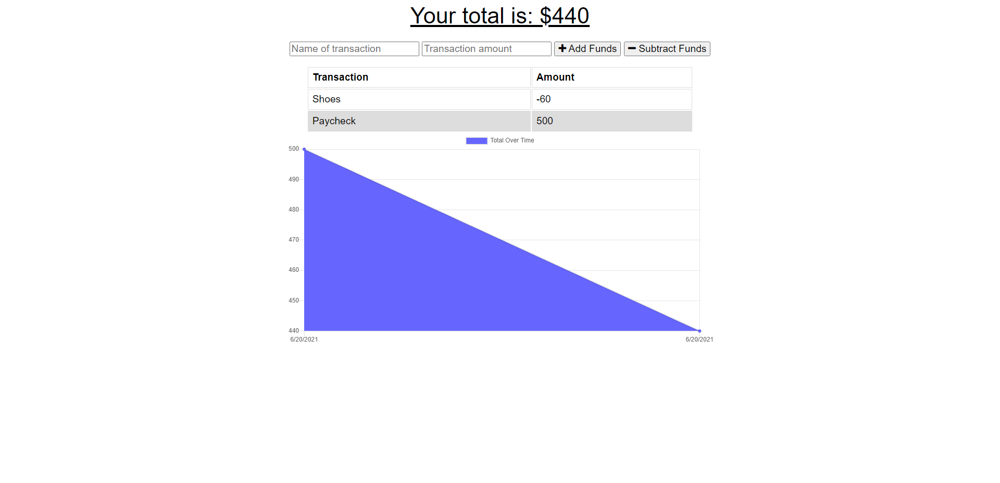

# Budget-Tracker-PWA

A simple budget tracker application that functions just as well offline as online and is also a Progressive Web Application(PWA). Users are able to make transactions to add/subtract funds with full offline functionality through the use of indexedDb and service-workers. 

# Link to Github
https://github.com/JakeDudum/Budget-Tracker-PWA

# Link to Deployed Site (Heroku)
https://whispering-badlands-65605.herokuapp.com/

# Built With
- [HTML](https://developer.mozilla.org/en-US/docs/Learn/HTML)
- [CSS](https://developer.mozilla.org/en-US/docs/Web/CSS)
- [Javascript](https://developer.mozilla.org/en-US/docs/Web/JavaScript)
- [Node](https://nodejs.org/en/about/)
- [NPM](https://docs.npmjs.com/about-npm/)
- [MongoDB](https://www.mongodb.com/)
- [IndexedDb](https://developer.mozilla.org/en-US/docs/Web/API/IndexedDB_API)

# Node Package's Used
- [Express](https://www.npmjs.com/package/express)
- [Mongoose](https://www.npmjs.com/package/mongoose)

# Versioning
- [Github](https://github.com/)

# Databases
- [MongoDB Atlas](https://www.mongodb.com/cloud/atlas)

# Authors
### Jake Dudum